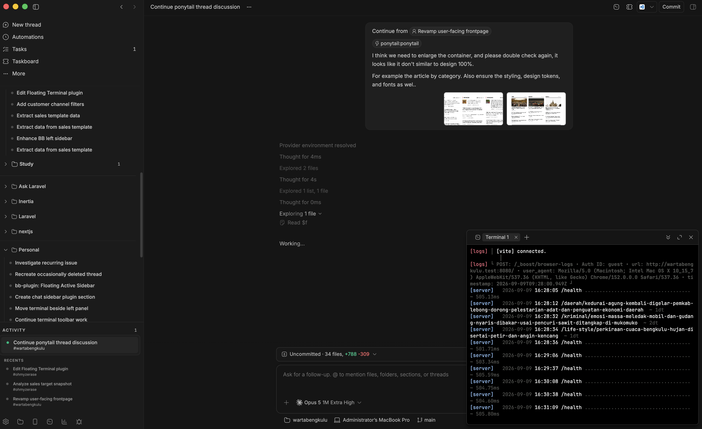
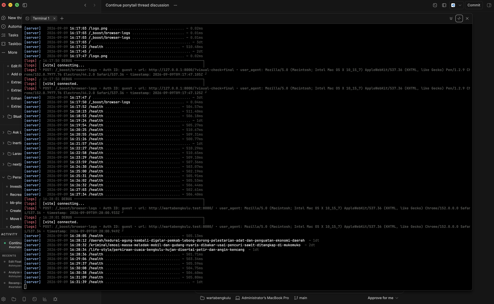
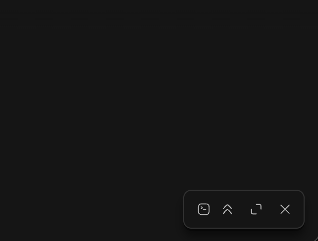

# Hmm Floating Terminal

Real shells in a floating, tabbed window that follows the project you are in,
opened from the New thread composer, the thread header, or `Ctrl+``.



Maximized, for when the output is the thing you are reading:



Minimized, it collapses to its own bar in the corner and keeps every shell
attached:



## Access

Every launcher opens the same thing: the terminal of the project you are
currently looking at.

- **New thread composer** — when a project is selected, the terminal glyph
  appears in the composer's action row, left of the microphone.
- **Thread header** — the terminal glyph in the header action row, left of BB's
  own controls.
- **`Ctrl+``** — opens a closed terminal, closes a normal terminal, and switches
  between maximized and minimized modes when the window is already in either
  mode.

## Following the project

Openness is remembered per project. Open the window in project A, switch to
project B and it steps aside; B is a project you have not opened it in. Open it
in B too, then return to A and A's tabs come back, with the shell that was
running still running. Leaving a project never stops its shells — nothing is
attached, that is all.

Away from any project — the home screen, settings, a plugin panel, or a New
thread before project selection — the window is hidden and `Ctrl+`` does
nothing. A shell has no checkout to live in there.

The window is anchored bottom-right: drag the grip in its top-left corner to
resize, or use the header buttons to minimize (collapse to a small bar with
just the terminal glyph and the window buttons; tabs come back on restore) and
maximize (90% of the viewport, centered). Minimizing keeps every session
attached — no shell is restarted.

The terminal paints itself with BB's own terminal palette — background,
foreground, selection, and the 16 ANSI colours — and repaints when you switch
BB's theme.

## Tabs

`+` in the tab bar adds a shell in the same project; `x` on a tab closes that
shell for good. Closing the last tab closes the window for that project. A
project's tabs are its own and follow you across that project's threads. The
tab you last selected in a project is the one you return to. Only the active
tab is mounted — switching back replays the session's scrollback from BB rather
than restarting anything.

## What runs

The plugin does not spawn processes. `session_list` / `session_create` /
`session_close` ask BB for terminals (`bb.sdk.terminals`) titled
`Hmm floating terminal <n>` in a `host_path` scope — the project's default
checkout, resolved through `projects.get` — and the frontend attaches xterm to
the host's own socket at `/ws/terminals/<id>`. Consequences worth knowing:

- The shell starts in the project's default checkout. A thread working in its
  own git worktree still gets the project's main checkout, not that worktree.
- Closing the window leaves every session running. Reopening reattaches to
  them as tabs, with scrollback replayed; a build or an ssh session survives.
  Closing a *tab* kills that shell.
- Terminals you open in BB's own terminal panel are untouched — the plugin only
  reuses sessions it created itself.
- `bb terminal list --machine <host> --cwd <project path>` shows the sessions
  like any other. `--thread` does not: they carry no thread.

## Development

```sh
npm install
node --test lib/frame.test.ts lib/scope.test.ts   # geometry and scope rules
npx tsc --noEmit
bb plugin build
bb plugin reload hmm-floating-terminal
```

`bb plugin dev .` rebuilds and reloads on every change.
